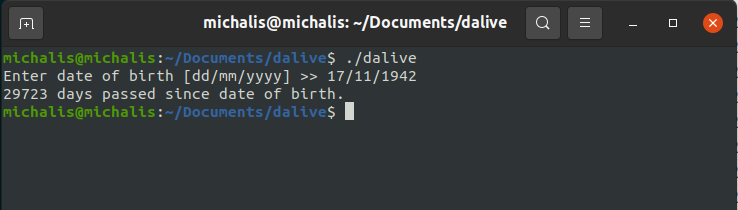

# Dalive - Days Lived Calculator

Ever wondered how many days you've lived since your birthday?

The `dalive` tool helps you find out by calculating the total number of days lived based on your date of birth and the current date.

## Build Instructions

Both methods create the executable containing the `dalive` tool.
Inside the project root directory:

1. Using `cmake`:
      ```bash
     mkdir build
     cd build
     cmake ..
     cmake --build .

2. Using `gcc`:
    
     ```console
     cd src/
     gcc main.c dalive.c dalive.h -g -o dalive.exe

## Executables
Executables for Linux and Windows x86_64 systems are provided in the corresponding directories

## Usage
- Run the `dalive` executable.
- Dates can be inserted in the format `dd/mm/yyyy`, `dd.mm.yyyy`, or `dd mm yyyy`.

Dalive screenshot:


